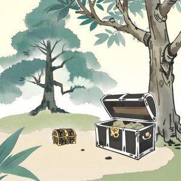

import { Editor } from '../../../src/algorithms/editor/editor'

# 1. The Pirate's Quest for Treasure



In this pirate adventure, Captain Tom buried his treasure behind trees with a certain number of branches, as indicated
on the treasure map. However, on this island, each tree is unique in terms of the number of branches it has. Given an
array representing the number of branches on each tree, locate the tree with the specified number of branches.

If the specified number of branches is not found, return -1.

```typescript
const treeBranches = [2, 4, 6, 8, 10]
const targetBranches = 6
findTreasureIndex(treeBranches, targetBranches) // Expected Output: Index of tree with 6 branches (2)
```

<Editor
  editorHeight={150}
  args="[2, 4, 6, 8, 10]"
  returnValue="6"
  expectedResult="2"
  initialCode={`function findTreasureIndex (treeBranches: number[], targetBranches: number): number {
  return -1;
}`} />
